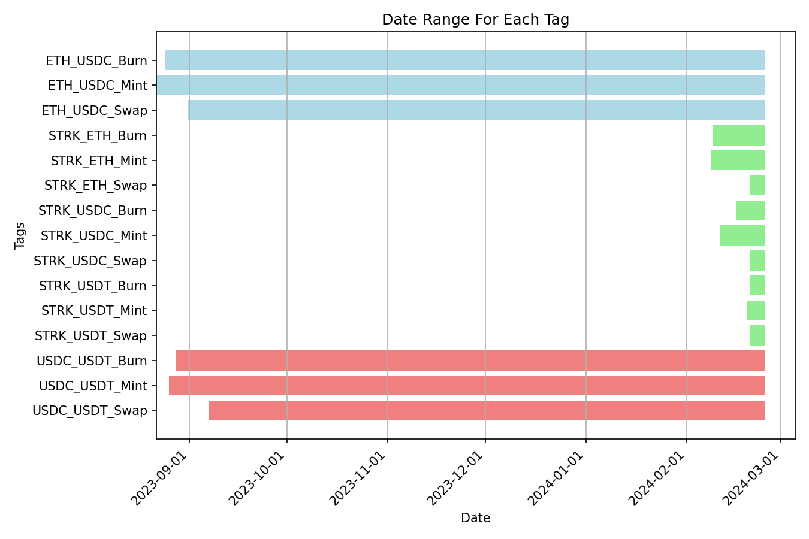

<!-- PROJECT LOGO -->
<a name="readme-top"></a>

<h3 align="center" style="font-size: 24px;">Ekubo Protocol (v3) Market Depth Analysis and Profit/Loss Calculation</h3>
<div>
  <p align="center" style="font-size: 22px;">
    Kevin Chao, Ph.D.
  </p>
  <p align="center">    
    Email: 
    	<a href="mailto:kevinchao@gmail.com">kevinchao@gmail.com</a>
    <br /> LinkedIn: 
    	<a href="https://www.linkedin.com/in/kevin-chao-com/">https://www.linkedin.com/in/kevin-chao-com/</a>
    <br /> GitHub:
    	<a href="https://github.com/rkevinchao">https://github.com/rkevinchao</a>
    <br /> Website:
    	<a href="https://kevinchao.com">https://kevinchao.com</a>
    <br />
  </p>
</div>

<!-- TABLE OF CONTENTS -->
<details open>
  <summary>Table of Contents</summary>
  <ol>
    <li> 
      <a href="#about-the-project">About The Project</a>      <!-- 1. ABOUT THE PROJECT -->
    </li>
    <li><a href="#summary">Summary</a></li>                   <!-- 2. Summary -->
    <li>
      <a href="#ekubo-dataset">Ekubo Dataset</a>              <!-- 3. Ekubo DataSet -->
      <ul>
        <li><a href="#dataset-structure">Dataset Structure</a></li>    <!-- 3.1 Dataset Structure-->
        <li><a href="#dataset-overview">Dataset Overview</a></li>      <!-- 3.2 Dataset Overview-->
      </ul>
    </li>
    <li>
      <a href="#methods">Methods</a>                                                      <!-- 4. Methods -->
      <ul>
        <li><a href="#method-1">Compute Aggregaed Dataset</a></li>                          <!-- 4.1 Methods-1 -->
        <li><a href="#method-2">Comparison of Daily Aggregated Data for ETH/USDC</a></li>   <!-- 4.2 Methods-2 -->
      </ul>
    </li>
    <li>
      <a href="#market-depth-analysis">Market Depth Analysis</a>  <!-- 5. Market Depth -->
      <ul>
        <li><a href="#eth-usdc">ETH/USDC</a></li>    <!--5.1 ETH/USDC-->
        <li><a href="#usdc-usdt"> USDC/USDT</a></li> <!--5.2 USDC/USDT-->
        <li><a href="#strk-eth">STRK/ETH</a></li>    <!--5.3 STRK/USDC-->
        <li><a href="#strk-usdc">STRK/USDC</a></li>  <!--5.4 STRK/USDC-->
      </ul>
    </li>    
    <li>
    	<a href="#pnl">Profit and Loss (PnL) Calculations</a></li>  <!--6. PnL-->
       <ul>
        <li><a href="#pnl-usdc-usdt">ETH/USDC</a></li>                 <!--6.1 USDC/USDT -->
        <li><a href="#pnl-strk-eth">STRK/ETH and STRK/USDC</a></li>    <!--6.2 STRK/ETH -->
       </ul>
    <li><a href="#discussion-conclusion">Discussion and Conclusion</a></li>   <!--7. Discussion and Conclusion-->
    <li><a href="#references">References</a></li>                             <!--8. References-->
  </ol>
</details>


<!-- ABOUT THE PROJECT -->
<a name="about-the-project"></a>
## 1. About The Project
The goal is to analyze the market depth of `Ekubo Protocol (v3)`[[1](https://docs.ekubo.org)] and provide profit and loss (PnL) calculation. The Ekuubo Protocol is an  automated market maker (AMM) designed for `Starknet`[[2](https://www.starknet.io/en/learn/what-is-starknet)], which is a layer 2 network on Ethereum providing a decentralized platform. Its unique features include concentrated liquidity and an extensible, gas-efficient architecture.

The targeted tasks consist of two parts: (1) Providing market depth for the Ekubo Protocol for STRK/ETH, STRK/USDC, ETH/USDC, and USDC/USDT pools. (2) Calculating the Profit and Loss (PnL) for a set of hypothetical positions held by the most profitable liquidity providers.

The deliverable results include a comprehensive report that details the methodology, findings, and recommendations. This report would be supported by data visualizations and code within Jupyter Notebooks to enhance the analysis.

Project Link: [https://github.com/rkevinchao/blockchain-data-analysis](https://github.com/rkevinchao/blockchain-data-analysis)
<p align="right">(<a href="#readme-top">back to top</a>)</p>

<a name="summary"></a>
## 2. Summary
Here is the summary of this report. Will update in the last.

Recommandations to the Ebubo Protocol:

1. r1
2. r2
3. r3
4. r4
5. r5

<p align="right">(<a href="#readme-top">back to top</a>)</p>


<!-- GETTING STARTED -->
<a name="ekubo-dataset"></a>
## 3. Ekubo Dataset

<a name="dataset-structure"></a>
### 3.1 Dataset Structure

The entire Ekubo Protocol dataset is stored in a Parquet file (which is not an open dataset), containing various data such as transaction details, liquidity events, and price movements. Below is a detailed explanation for each column.

* `BLOCK_NUMBER`: The block when the transaction occurred
* `BLOCK_TIMESTAMP`: The timestamp of the block
* `TX_HASH`: The unique hash of the transaction where the event occurred (a given transaction can include multiple events)
* `TX_ID`: An identifier that indicates where in the block the transaction occurred
* `POOL_ID`: A unique identifier of the liquidity pool
* `TOKEN0_ADDRESS`: Starknet address of token0
* `TOKEN1_ADDRESS`: Starknet address of token1
* `EVENT_NAME`: The type of event (`Mint`, `Burn`, or `Swap`)
* `FROM_ADDRESS`: The user’s address
* `TO_ADDRESS`: The contract address
* `TOKEN0_RAW_AMOUNT`: Raw (not decimal adjusted) number of token0 transferred
* `TOKEN0_DECIMALS`: Number of decimal places of token0
* `TOKEN0_REAL_AMOUNT`: `TOKEN0_RAW_AMOUNT / 10 ** TOKEN0_DECIMALS`
* `TOKEN1_RAW_AMOUNT`: Raw (not decimal adjusted) number of token1 transferred
* `TOKEN1_DECIMALS`: Number of decimal places of token1
* `TOKEN1_REAL_AMOUNT`: `TOKEN1_RAW_AMOUNT / 10 ** TOKEN1_DECIMALS`
* `FEE_TIER`: The fee rate of the pool (only Swap transactions pay fees)
* `LIQUIDITY_AMOUNT`: The amount of liquidity added in a Mint or subtracted in a Burn between `LOWER_TICK` and `UPPER_TICK` (NB: This number is not denominated in either token. You need Uniswap-style constant product math to convert this to a token amount)
* `LOWER_TICK`: The lower bound of the tick range that liquidity was added to in a Mint or subtracted from in Burn
* `UPPER_TICK`: The upper bound of the tick range that liquidity was added to in a Mint or subtracted from in Burn
* `SWAP_TICK`: The final price tick reached after a Swap (set to 0 for all Mints and Burns)
* `TICK_SPACING`: Defines the intervals on which users are allowed to add or subtract liquidity in the given pool (not relevant to this assignment)

<p align="right">(<a href="#readme-top">back to top</a>)</p>

<a name="dataset-overview"></a>
### 3.2 Dataset Overview

* <a href="https://github.com/rkevinchao/blockchain-data-analysis/blob/main/01a_dataset_overview.ipynb">01a\_dataset\_overview.ipynb</a>: This Jupyter Notebook includes the code used to generate the results presented in Session 3.2.

* An updated dataframe table:
	* At the top of the raw dataframe, I added the following additional columns to provide a better overview of the dataset:
		* `Token0_name`: based on inforamtion from `TOKEN0_ADDRESS`, e.g., `STRK`
		* `Token1_name`: based on inforamtion from `TOKEN1_ADDRESS`, e.g., `USDC`
		* `tag`: for classify each trading-pair-type, e.g., `STRK_ETH_Swap`

* An overview of the updated dataframe structure:

```
df.info()
```

```
<class 'pandas.core.frame.DataFrame'>
Int64Index: 3024741 entries, 71486 to 1779938
Data columns (total 27 columns):
 #   Column              Dtype         
---  ------              -----         
 0   BLOCK_NUMBER        int64         
 1   BLOCK_TIMESTAMP     datetime64[ns]
 2   TX_HASH             object        
 3   TX_ID               object        
 4   POOL_ID             object        
 5   TOKEN0_ADDRESS      object        
 6   TOKEN1_ADDRESS      object        
 7   EVENT_NAME          object        
 8   FROM_ADDRESS        object        
 9   TO_ADDRESS          object        
 10  TOKEN0_RAW_AMOUNT   float64       
 11  TOKEN0_DECIMALS     int64         
 12  TOKEN0_REAL_AMOUNT  float64       
 13  TOKEN1_RAW_AMOUNT   float64       
 14  TOKEN1_DECIMALS     int64         
 15  TOKEN1_REAL_AMOUNT  float64       
 16  FEE_TIER            float64       
 17  LIQUIDITY_AMOUNT    float64       
 18  LOWER_TICK          float64       
 19  UPPER_TICK          float64       
 20  SWAP_TICK           float64       
 21  TICK_SPACING        int64         
 22  datetime            datetime64[ns]
 23  timestamp           int64         
 24  Token0_name         object        
 25  Token1_name         object        
 26  tag                 object        
dtypes: datetime64[ns](2), float64(9), int64(5), object(11)
memory usage: 646.2+ MB
```

* A quick view of the values in one randomly selected row:

```
df.iloc[108]
```

```
BLOCK_NUMBER                                                     175738
BLOCK_TIMESTAMP                                     2023-08-27 14:57:12
TX_HASH               0x07c98ed05759e1b0047bf8eafa41e30065a6985f8d88...
TX_ID                                              5461067_0_175738_163
POOL_ID               0x00000005dd3d2f4429af886cd1a3b08289dbcea99a29...
TOKEN0_ADDRESS        0x049d36570d4e46f48e99674bd3fcc84644ddd6b96f7c...
TOKEN1_ADDRESS        0x053c91253bc9682c04929ca02ed00b3e423f6710d2ee...
EVENT_NAME                                                         Mint
FROM_ADDRESS          0x036fd071faaead90780ee4161eab85a9fc2598e8e8e6...
TO_ADDRESS            0x00000005dd3d2f4429af886cd1a3b08289dbcea99a29...
TOKEN0_RAW_AMOUNT                                  -11825645732386756.0
TOKEN0_DECIMALS                                                      18
TOKEN0_REAL_AMOUNT                                            -0.011826
TOKEN1_RAW_AMOUNT                                           -20000000.0
TOKEN1_DECIMALS                                                       6
TOKEN1_REAL_AMOUNT                                                -20.0
FEE_TIER                                                          0.003
LIQUIDITY_AMOUNT                                        8376507117481.0
LOWER_TICK                                                  -20350764.0
UPPER_TICK                                                  -20111484.0
SWAP_TICK                                                           0.0
TICK_SPACING                                                       5982
datetime                                            2023-08-27 14:57:12
timestamp                                                    1693148232
Token0_name                                                         ETH
Token1_name                                                        USDC
tag                                                       ETH_USDC_Mint
Name: 110352, dtype: object
```

* In the Ekubo dataset, there are five types of trading pair (`Token0/Token1`) and three event types: 
	1. STRK/ETH (Mint, Burn, and Swap)
	2. STRK/USDC (Mint, Burn, and Swap)
	3. STRK/USDT (Mint, Burn, and Swap)
	4. ETH/USDC (Mint, Burn, and Swap)
	5. USDC/USDT (Mint, Burn, and Swap)

* Addresses and Contract shown in Ekubo:
	- STRK Token (in TOKEN0\_ADDRESS and TOKEN1\_ADDRESS): `0x04718f5a0fc34cc1af16a1cdee98ffb20c31f5cd61d6ab07201858f4287c938d` [[3](https://starkscan.co/token/0x04718f5a0fc34cc1af16a1cdee98ffb20c31f5cd61d6ab07201858f4287c938d)]
	- ETH Token (in TOKEN0\_ADDRESS and TOKEN1\_ADDRESS): `0x049d36570d4e46f48e99674bd3fcc84644ddd6b96f7c741b1562b82f9e004dc7` [[4](https://starkscan.co/token/0x049d36570d4e46f48e99674bd3fcc84644ddd6b96f7c741b1562b82f9e004dc7)]
	- USDC Token (in TOKEN0\_ADDRESS and TOKEN1\_ADDRESS): `0x053c91253bc9682c04929ca02ed00b3e423f6710d2ee7e0d5ebb06f3ecf368a8` [[5](https://starkscan.co/token/0x053c91253bc9682c04929ca02ed00b3e423f6710d2ee7e0d5ebb06f3ecf368a8)]
	- USDT Token (in TOKEN1\_ADDRESS): `0x068f5c6a61780768455de69077e07e89787839bf8166decfbf92b645209c0fb8` [[6](https://starkscan.co/token/0x068f5c6a61780768455de69077e07e89787839bf8166decfbf92b645209c0fb8)]
	- Ekubo Contract (in TO\_ADDRESS): `0x00000005dd3d2f4429af886cd1a3b08289dbcea99a294197e9eb43b0e0325b4b` [[7](https://starkscan.co/contract/0x00000005dd3d2f4429af886cd1a3b08289dbcea99a294197e9eb43b0e0325b4b)]

* Plot % of rows for each tag among the whole dataset: 


* Date range plot for each tag:


* Date range for each trading pair:
	- The whole dataset: `2023-08-21 18:06:57` to `2024-02-25 03:57:43`
	- ETH/USDC pools: `2023-08-21 18:06:57` to `2024-02-25 03:57:43`
	- USDC/USDT pools: `2023-08-25 17:26:00` to `2024-02-25 03:57:26`
	- STRK/ETH pools: `2024-02-08 12:27:13` to `2024-02-25 03:57:26`
	- STRK/USDC pools: `024-02-11 11:21:18` to `2024-02-25 03:57:26`
	- STRK/USDT pools: `2024-02-19 16:26:11` to `2024-02-25 03:36:21`

* Top five trading pair events in Ekubo:
	1. ETH/USDC-Swap (54.0%)
	2. USDC/USDT-Swap (24.6%)
	3. ETH/USDC-Mint (7.61%)
	4. STRK/ETH-Swap (4.38%)
	5. ETH/USDC-Burn (3.82%)
   
<p align="right">(<a href="#readme-top">back to top</a>)</p>

<a name="methods"></a>
## 4. Methods
* <a href="https://github.com/rkevinchao/blockchain-data-analysis/blob/main/01b_compute_aggregations_table.ipynb">01b\_compute\_aggregations\_table.ipynb</a>: This Jupyter Notebook includes the code used to generate the results presented in *Session 4*. 

In this sesson, I first present the methods I used to compute `daily` and `hourly` aggregated tables for the Ekubo Protocol dataset in *Session 4.1*. The computation includes (1) the aggregated token price for each trading pair and (2) number of tokens in the pool for a given day. 

Next, I compared the daily aggregated ETH/USDC price with public available ETH/USD price to confirm the reliability of the aggregated tabels from this study.

<p align="right">(<a href="#readme-top">back to top</a>)</p>

<a name="method-1"></a>
### 4.1 Compute Aggregaed Dataset
* The aggregated price for trading pair tokens, such as ETH/USDC, is computed with the ***median*** value within a time range (e.g., in a day or in an hour) from the token ratio (`TOKEN1/TOKEN0`) of the token amount. 

	* To compute price of trading pair:
		* `RATIO_TOKEN1_TOKEN0 = TOKEN1_REAL_AMOUNT / TOKEN0_REAL_AMOUNT`
		* `Pair_Price = median(RATIO_TOKEN1_TOKEN0)`
	* To compute total token in the pool for a given day or hour:
		* `amount_cumulative_buy_sell_swap`: compute total cumutive amount of token (net amount) by adding cumulative buy and cumulative sell tokens on and before a given day or hour.  


The outputs of the aggregated dataset include the following CSV files:

* Daily Aggregated Datasets:
	* df\_agg\_daily\_all.csv
		* df\_agg\_daily\_STRK\_USDC.csv 
		* df\_agg\_daily\_STRK\_USDT.csv
		* df\_agg\_daily\_STRK\_ETH.csv
		* df\_agg\_daily\_ETH\_USDC.csv
		* df\_agg\_daily\_USDC\_USDT.csv
* Hourly Aggregated Datasets: 
	* df\_agg\_hourly\_all.csv
		* df\_agg\_hourly\_STRK\_USDC.csv
		* df\_agg\_hourly\_STRK\_USDT.csv
		* df\_agg\_hourly\_STRK\_ETH.csv

Below are the columns included in the aggregated csv files:

* `tag`: ESTRK\_ETH, STRK\_USDC, STRK\_USDT, ETH\_USDC, or USDC\_USDT.
* `token0`: STRK, ETH, or USDC
* `token1`: STRK, ETH, or USDT
* `date`: Beginning Date and Time of that day or hour
* `timestamp`: timestamp 
* `token0_daily_price_median_mint`: median price of token0/token1 for mint event
* `token0_daily_amount_mint`: count of token0 for mint
* `token0_daily_price_median_burn`: median price of token0/token1 for burn event
* `token0_daily_amount_burn`: count of token0 for burn
* `token0_daily_amount_net_mint_burn`: net amount of token0 by adding mint and burn
* `liquidity_daily_sum_mint`: sum of liquidity for mint
* `liquidity_daily_sum_burn`: sum of liquidity for burn
* `liquidity_daily_net_mint_burn`: total net liquidity by adding mint and burn
* `liquidity_daily_cum_sum_mint`: 
* `liquidity_daily_cum_sum_burn`:
* `token0_daily_price_median_swap`: median price of token0/token1 for swap event
* `token0_daily_price_min_swap`: min price for swap event
* `token0_daily_price_max_swap`: max price for swap event
* `token0_daily_price_std_swap`: std for swap event
* `token0_daily_amount_buy_swap`: total buying amount of token for swap event
* `token0_daily_amount_sell_swap`: total selling amount of token for swap even
* `token0_daily_amount_net_swap`: total net amount of token by adding buy and sell
* `token0_daily_amount_cum_buy_swap`: cumulative buy amount of token by adding all buy amount before the current day or hour
* `token0_daily_amount_cum_sell_swap`: cumulative sell amount of token by adding all buy amount before the current day or hour
* `token0_daily_amount_cum_net_swap`: cumulative net amount of token by adding cumulative buy and sell amounts
* `total_events_daily_mint`: total mint events used to compoute the aggregated results
* `total_events_daily_burn`: total burn events used to compoute the aggregated results
* `total_events_daily_swap`: total swap events used to compoute the aggregated results
* `total_events_daily`: total events (mint, burn, and swap) in a day or hour


<p align="right">(<a href="#readme-top">back to top</a>)</p>

<a name="method-2"></a>
### 4.2 Comparison of Daily Aggregated Data for ETH/USDC 

* Example outputs of a row for the ETH/USDC file:  
```
df_ETH_USDC.iloc[22]
```

```
tag                                            ETH_USDC
token0                                              ETH
token1                                             USDC
date                                         2023-09-14
timestamp                                    1694649600
token0_daily_price_median_mint              1689.320632
token0_daily_amount_mint                     -12.798675
token0_daily_price_median_burn              1689.320586
token0_daily_amount_burn                       0.456841
token0_daily_amount_net_mint_burn            -12.341834
liquidity_daily_sum_mint             9630181268773528.0
liquidity_daily_sum_burn             -324302866910177.0
liquidity_daily_net_mint_burn        9305878401863352.0
liquidity_daily_cum_sum_mint         9630181268773528.0
liquidity_daily_cum_sum_burn         -324302866910177.0
liquidity_daily_cum_net_mint_burn    9305878401863352.0
token0_daily_price_median_swap              1629.834986
token0_daily_price_min_swap                 1292.546316
token0_daily_price_max_swap                 1645.132325
token0_daily_price_std_swap                   19.663286
token0_daily_amount_buy_swap                  11.273301
token0_daily_amount_sell_swap                 -7.499795
token0_daily_amount_net_swap                   3.773506
token0_daily_amount_cum_buy_swap              11.273301
token0_daily_amount_cum_sell_swap             -7.499795
token0_daily_amount_cum_net_swap               3.773506
total_events_daily_mint                              78
total_events_daily_burn                              10
total_events_daily_swap                             450
total_events_daily                                  538
Name: 22, dtype: object
```

* Plot ETH price comparison between the aggregated ETH/USDC price from this study versus the ETH/USD price download with `pycoingecko`: 


<p align="right">(<a href="#readme-top">back to top</a>)</p>

<!-- USAGE EXAMPLES -->
<a name="market-depth-analysis"></a>
## 5. Market Depth Analysis

Use this space to show useful examples of how a project can be used. Additional screenshots, code examples and demos work well in this space. You may also link to more resources.

_For more examples, please refer to the [Documentation](https://example.com)_

<p align="right">(<a href="#readme-top">back to top</a>)</p>

<a name="eth-usdc"></a>
### 5.1 ETH/USDC

<p align="right">(<a href="#readme-top">back to top</a>)</p>

<a name="usdc-usdt"></a>
### 5.2 USDC/USDT

<p align="right">(<a href="#readme-top">back to top</a>)</p>

<a name="strk-eth"></a>
### 5.3 STRK/ETH

<p align="right">(<a href="#readme-top">back to top</a>)</p>

<a name="strk-usdc"></a>
### 5.4 STRK/USDC

<p align="right">(<a href="#readme-top">back to top</a>)</p>

<!-- ROADMAP -->
<a name="pnl"></a>
## 6. Profit and Loss (PnL) Calculations

- [ ] Feature 1
- [ ] Feature 2
- [ ] Feature 3
    - [ ] Nested Feature

See the [open issues](https://github.com/github_username/repo_name/issues) for a full list of proposed features (and known issues).

<p align="right">(<a href="#readme-top">back to top</a>)</p>

<a name="pnl-usdc-usdt"></a>
### 6.1 STRK/USDC

<p align="right">(<a href="#readme-top">back to top</a>)</p>

<a name="pnl-strk-eth"></a>
### 6.2 STRK/USDC

<p align="right">(<a href="#readme-top">back to top</a>)</p>


<!-- CONTRIBUTING -->
<a name="discussion-conclusion"></a>
## 7. Discussion and Conclusion

Contributions are what make the open source community such an amazing place to learn, inspire, and create. Any contributions you make are **greatly appreciated**.

If you have a suggestion that would make this better, please fork the repo and create a pull request. You can also simply open an issue with the tag "enhancement".
Don't forget to give the project a star! Thanks again!

1. Fork the Project
2. Create your Feature Branch (`git checkout -b feature/AmazingFeature`)
3. Commit your Changes (`git commit -m 'Add some AmazingFeature'`)
4. Push to the Branch (`git push origin feature/AmazingFeature`)
5. Open a Pull Request

<p align="right">(<a href="#readme-top">back to top</a>)</p>


<!-- ACKNOWLEDGMENTS -->
## 8. References
<a name="references"></a>

* [[1](https://docs.ekubo.org)] Ekubo Protocol, https://docs.ekubo.org
* [[2](https://www.starknet.io/en/learn/what-is-starknet)] Starknet, https://www.starknet.io/en/learn/what-is-starknet
* [[3](https://starkscan.co/token/0x04718f5a0fc34cc1af16a1cdee98ffb20c31f5cd61d6ab07201858f4287c938d)] STRK Token, https://starkscan.co/token/0x04718f5a0fc34cc1af16a1cdee98ffb20c31f5cd61d6ab07201858f4287c938d
* [[4](https://starkscan.co/token/0x049d36570d4e46f48e99674bd3fcc84644ddd6b96f7c741b1562b82f9e004dc7)] ETH Token, https://starkscan.co/token/0x049d36570d4e46f48e99674bd3fcc84644ddd6b96f7c741b1562b82f9e004dc7 
* [[5](https://starkscan.co/token/0x053c91253bc9682c04929ca02ed00b3e423f6710d2ee7e0d5ebb06f3ecf368a8)] USDC Token, https://starkscan.co/token/0x053c91253bc9682c04929ca02ed00b3e423f6710d2ee7e0d5ebb06f3ecf368a8
* [[6](https://starkscan.co/token/0x068f5c6a61780768455de69077e07e89787839bf8166decfbf92b645209c0fb8)] USDT Token, https://starkscan.co/token/0x068f5c6a61780768455de69077e07e89787839bf8166decfbf92b645209c0fb8 
* [[7](https://starkscan.co/contract/0x00000005dd3d2f4429af886cd1a3b08289dbcea99a294197e9eb43b0e0325b4b)] Ekubo Contract, https://starkscan.co/contract/0x00000005dd3d2f4429af886cd1a3b08289dbcea99a294197e9eb43b0e0325b4b
* [[]()] 
* [[]()] 
* [[]()] 
* [[]()] 

<p align="right">(<a href="#readme-top">back to top</a>)</p>